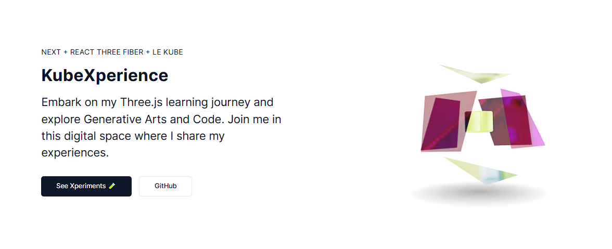

# KubeXperience 🧪
A collection app of Three.js canvases for an immersive learning experience.


[](https://opensource.org/licenses/MIT)

## Table of Contents
- [Introduction](#introduction)
- [Features](#features)
- [Installation](#installation)
- [Usage](#usage)
- [Contributing](#contributing)
- [License](#license)

## Introduction
KubeXperience is a collection app built with Next.js 13 and [@shadcn/ui](https://ui.shadcn.com/), leveraging the power of Three.js to create interactive and engaging canvases. Whether you are a beginner or an experienced developer, KubeXperience provides a fun way to explore Three.js.

## Features
- Interactive Three.js canvases
- Next.js 13 for efficient development
- @shadcn/ui for sleek and modern UI components

## Installation
To get started with KubeXperience, follow these steps:

1. Clone the repository:

```shell
git clone https://github.com/mkubdev/KubeXperience
```

2. Install dependencies

```shell
npm install
```

## Usage

To run KubeXperience locally, use the following command:

```shell
npm run dev
```

This will start the development server. Open your browser and navigate to `http://localhost:3000` to access the app.

## Contributing

Contributions are welcome! If you have any ideas, suggestions, or bug fixes, please open an issue or submit a pull request. Let's make KubeXperience even better together!

## License
This project is licensed under the [MIT License](./LICENSE.md).
